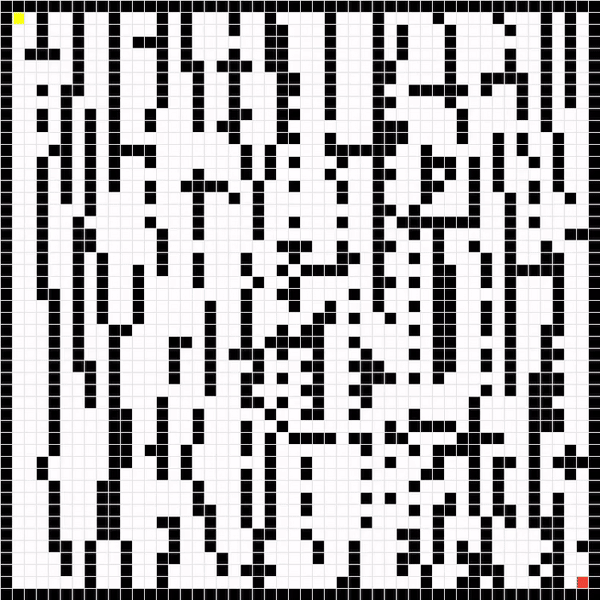

Welcome to AlgoViewer
============================================
by -- Alex Israel Martínez

.. toctree::
   :maxdepth: 3

   science
   getting
   
   

Overview 
____________________________________________
--------------------------------------------

This project corresponds to my personal preferences in Computer Science, given the chance to explore and create whatever API I wished. I chose to dive into the realm of two subjects I have a great passion for -

- Path Finding Algorithms and,
- Data Structures

If you are completely new to AlgoViewer, get started now in the :ref:`Quick Start Guide<started>` section.

Problem
____________________________________________
--------------------------------------------

I have been very visual throughout all my life, and writing down simple data structures with pen on paper has always helped me understand the subject for the better.  For this occasion, and after many dedicated hours into getting a basic understanding of Sorting and Path Finding algorithms, I think it is an excellent practice to create an API that traverses visually any generated graph structure. In addition to that, create a small Data Base of different types of Algorithms to choose from and learn about the inner workings visually.

Solution
____________________________________________
--------------------------------------------

An API capable of traversing any path-finding algorithm through a graph-like data structure in a visual fashion, with the following -

Featured Algorithms:
~~~~~~~~~~~~~~~~~~~~~~~~~~~~~~~~~~~~~~~~~~~~
- DFS,
- BFS,
- A Star,
- Cownway's Game Of Life

If you are completely new to this concepts, get started now in the :ref:`Graph Theory<intro>` section.

Repository
____________________________________________
--------------------------------------------

Feel Free to surf the Repository any time: `AlgoViewer - Official Repo
<https://github.com/alexisraelmtz/algoViewer/>`_.

Indices and Tables
____________________________________________
--------------------------------------------

* :ref:`genindex`
* :ref:`modindex`
* :ref:`search`
